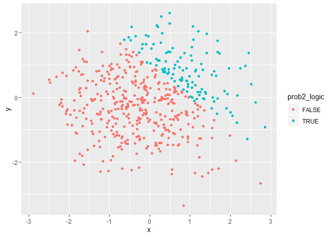
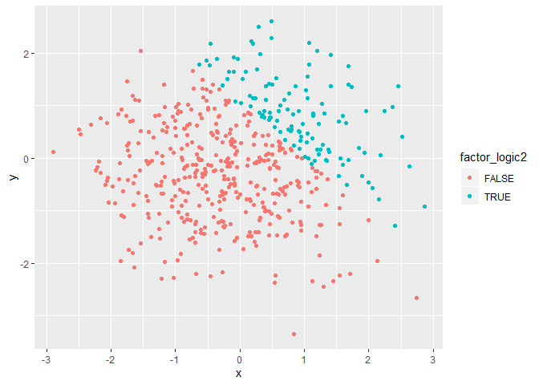

p8105\_hw1\_ha2546
================
Hana Akbarnejad
9/13/2019

# problem 1

## 1-1

First, I have created a data frame containing a random sample of size 8
from a Standard Normal Distribution, a logical vector indicating whether
elements of the sample are greater than 0, a character vector of length
8, and a factor vector of size 8 with three different levels. On the
next step, I tried to calculate the mean of each variable in my data
frame.

``` r
prob1_df = tibble(
  vec_sample = rnorm(8),
  vec_logic = vec_sample > 0,
  vec_char = c("This", "is", "problem", "one", "homework", "one", "Hana", "Akbarnejad"),
  vec_factor = factor(c("good", "fair", "poor", "poor", "fair", "fair", "fair", "fair"))
)

mean(pull(prob1_df, vec_sample))
```

    ## [1] -0.164908

``` r
mean(pull(prob1_df, vec_logic))
```

    ## [1] 0.375

``` r
mean(pull(prob1_df, vec_char))
```

    ## Warning in mean.default(pull(prob1_df, vec_char)): argument is not numeric
    ## or logical: returning NA

    ## [1] NA

``` r
mean(pull(prob1_df, vec_factor))
```

    ## Warning in mean.default(pull(prob1_df, vec_factor)): argument is not
    ## numeric or logical: returning NA

    ## [1] NA

  - **Results**

When trying to calculate the mean for the variables in my data frame, I
observed that it is not possible for character and factor arguments.
This observation is what was actually expected because calculating mean
is only possible for numeric or logical vectors.

## 1-2

In the second part, I have tried to convert the logical, character, and
factor variables’ types I had to numeric:

``` r
as.numeric(pull(prob1_df, vec_logic))
as.numeric(pull(prob1_df, vec_char))
as.numeric(pull(prob1_df, vec_factor))
```

  - **Results**

It was observed that we were unable to convert character vector to
numeric. However, logical and factor vectors were converted to numeric
form. That is the reason why we were unable to take the mean for
character vector. We also can conclude that we cannot take the mean of
factor vectors as they are, but we are able to convert them to numeric
form and then take the mean.

## 1-3

On the final step for question one, I played a little bit with the
logical vector\! First, I did some calculations with the logical vector
that I had just converted to numeric in the last part. Then, I converted
the logical vector to factor, and tried to do calculations, then
converted it to numeric again, and done some calculations.

Then, I have converted the logical vector again, but this time to a
factor vector. And again, done some calculations…

``` r
num_logic = as.numeric(pull(prob1_df, vec_logic))

num_logic_calc = pull(prob1_df, vec_sample) * num_logic
num_logic_calc
```

    ## [1] 0.07278545 0.00000000 0.00000000 0.00000000 0.00000000 0.00000000
    ## [7] 0.85803858 1.55099060

``` r
factor_logic = as.factor(pull(prob1_df, vec_logic))
factor_logic_calc1 = pull(prob1_df, vec_sample) * factor_logic
```

    ## Warning in Ops.factor(pull(prob1_df, vec_sample), factor_logic): '*' not
    ## meaningful for factors

``` r
factor_logic
```

    ## [1] TRUE  FALSE FALSE FALSE FALSE FALSE TRUE  TRUE 
    ## Levels: FALSE TRUE

``` r
factor_logic_calc1
```

    ## [1] NA NA NA NA NA NA NA NA

``` r
num_factor_logic = as.numeric(factor_logic)
factor_logic_calc2 = pull(prob1_df, vec_sample) * num_factor_logic
num_factor_logic
```

    ## [1] 2 1 1 1 1 1 2 2

``` r
factor_logic_calc2
```

    ## [1]  0.14557090 -0.03842451 -0.05434505 -0.31033965 -1.47422828 -1.92374125
    ## [7]  1.71607716  3.10198120

  - **Results**

It can be observed that calculations are possible when dealing with
logical vector after it was transformed to numeric but it is not
possible when we convert it to factor (which was expected due to
previous parts). Also, when we saw that transforming factors to numerics
is possible, so we are able to do calculations when we convert the
factor to numeric.

# Problem 2

## 2.1

First, I am going to creat a data frame, define varian=bles x and y, and
a logical vector. Then I transformed the logical vector to numeric and
factor.

``` r
prob2_df = tibble(
  x = rnorm(500),
  y = rnorm(500),
  prob2_logic = x + y > 1,
  num_logic2 = as.numeric(prob2_logic),
  factor_logic2 = as.factor(prob2_logic)
)
```

The size of my dataset for problem 2 (named prob2\_df) is 500, 5; which
means it has 500 rows and 5columns. The mean of x is 0.0085232, its
median is -0.0068241, and its standard deviation is 0.9784241. The
proportion of cases for which x + y \> 1 is 0.218

## 2.2

In this part, I have made three scatter plots and colored the points
using 1- logical variable, 2- numeric variable, and 3- factor
variable.

``` r
logic_scatterplot = ggplot(prob2_df, aes(x = x, y = y, color = prob2_logic)) + geom_point()
logic_scatterplot
```

<!-- -->

``` r
num_logic_scatterplot = ggplot(prob2_df, aes(x = x, y = y, color = num_logic2)) + geom_point()
num_logic_scatterplot
```

<!-- -->

``` r
factor_logic_scatterplot = ggplot(prob2_df, aes(x = x, y = y, color = factor_logic2)) + geom_point()
factor_logic_scatterplot
```

<!-- -->

``` r
ggsave("logic_scatterplot.pdf")
```

    ## Saving 7 x 5 in image

  - **Results**

When we try to color with logical vector, we have only two colors
because it is either true or false. Whne working with numeric one,
because it is a range, we get a range of colors although we only get two
golors in our plot due to the properties of the case we are working
with. For logical vector, it is again only tru and false cases, so we
again only get two colors.
